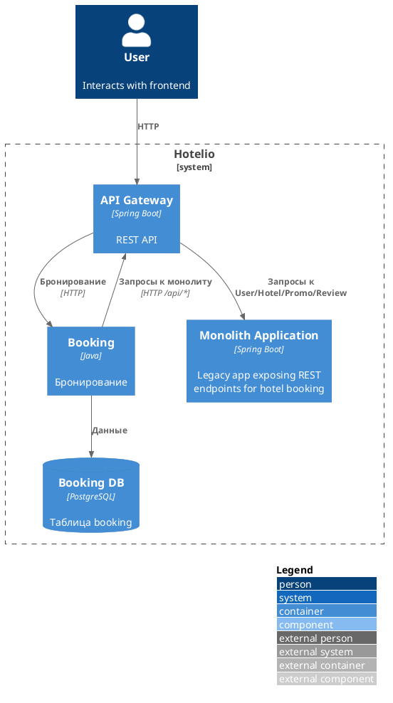
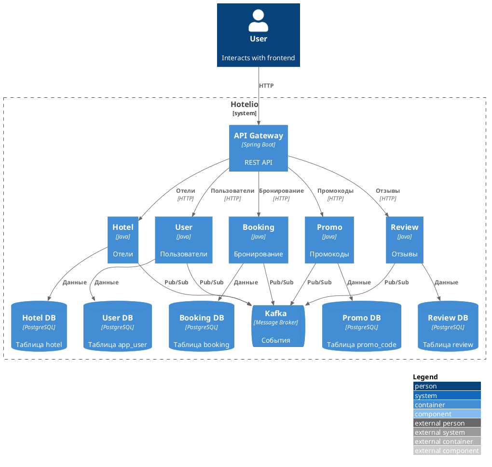

### **Название задачи:** ADR-001. Целевое состояние системы Hotelio

### **Автор:** Алексей Киселёв

### **Дата:** 08.09.2026

### **Функциональные требования**

| **№** | **Действующие лица или системы** | **Use Case**               | **Описание**                                                                           |
| ----- | -------------------------------- | -------------------------- | -------------------------------------------------------------------------------------- |
| UC-01 | Пользователь                     | Поиск отелей               | Пользователь ищет отели по городу и рейтингу. Система возвращает карточки отелей.      |
| UC-02 | Пользователь                     | Просмотр отеля и репутации | Пользователь смотрит информацию об отеле, в т.ч. отзывы и репутацию.                   |
| UC-03 | Зарегистрированный пользователь  | Проверка профиля           | Пользователь смотрит информацию о своём профиле. Данные используются при бронировании. |
| UC-04 | Зарегистрированный пользователь  | Применение промокода       | Пользователь проверяет код и скидку по нему.                                           |
| UC-05 | Зарегистрированный пользователь  | Создание бронирования      | Пользователь запрашивает бронирование, а система бронирует отель.                      |
| UC-06 | Зарегистрированный пользователь  | Список бронирований        | Пользователь смотрит свои брони.                                                       |

### **Нефункциональные требования**

| **№**  | **Требование**                                                  |
| ------ | --------------------------------------------------------------- |
| NFR-01 | Поэтапная миграция.                                             |
| NFR-02 | Релиз через CI/CD (Kubernetes + Helm) и Rollouts развёртывание. |
| NFR-03 | Обратная совместимость API.                                     |
| NFR-04 | Внедрение метрик и трассировки каждого сервиса.                 |
| NFR-05 | У каждого сервиса своя БД.                                      |
| NFR-06 | Переход на брокер сообщений (Kafka).                            |

### **Решение**

#### Ключевые проблемы

1. Сложность сопровождения. Сильная связность компонентов.
2. Нельзя масштабировать. Высокая нагрузка.
3. Нет независимых команд. Один репозиторий, один артефакт, общий релизный цикл.
4. API неудобен для разных клиентов. Нет GraphQL.

#### Первый модуль для миграции: `Booking`

Выносим модуль бронирования (`BookingService`, в т.ч. API `/api/bookings` и таблицу `bookings`).

- Это узкое место c нагрузкой, которое можно потом масштабировать.
- Можно сразу описать "антикоррупционный слой" к сервисам.
- Проще реализовать, т.к. он будет в роли "шлюза" и вызывать API монолита и остальных сервисов.

- MoSCoW. Booking - Must have. Без бронирования нет ценности сервиса. Остальное - Should/Could и можно в очередь.
- Матрица Эйзенхауэра. Booking - срочно и важно. Сбои и узкие места в бронировании влияют на доход и клиентов, поэтому мигрируем первым. Остальное (промо, отзывы, аналитика) - менее срочное и можно отложить.

[design_02_booking.puml](./design_02_booking.puml) | [design_02_booking.png](./design_02_booking.png)

#### План миграции (Strangler Fig)

1. Перед монолитом ставим API Gateway.
2. Gateway по умолчанию вызывает старый `BookingService`.
3. Рядом поднимаем новый микросервис `Booking` со своей БД. Gateway переключает трафик на новый сервис.
4. Новый сервис ходит в монолит.
5. Когда полностью успешно перенесём на новый сервис, код `BookingService` в монолите удаляем.
6. Дальше по одному выносятся остальные микросервисы: `Hotel`, `User`, `Promo`, `Review`.

[design_03_target.puml](./design_03_target.puml) | [design_03_target.png](./design_03_target.png)

### **Альтернативы**

Сделать сразу все микросервисы. Высокий риск, требует больше ресурсов.
